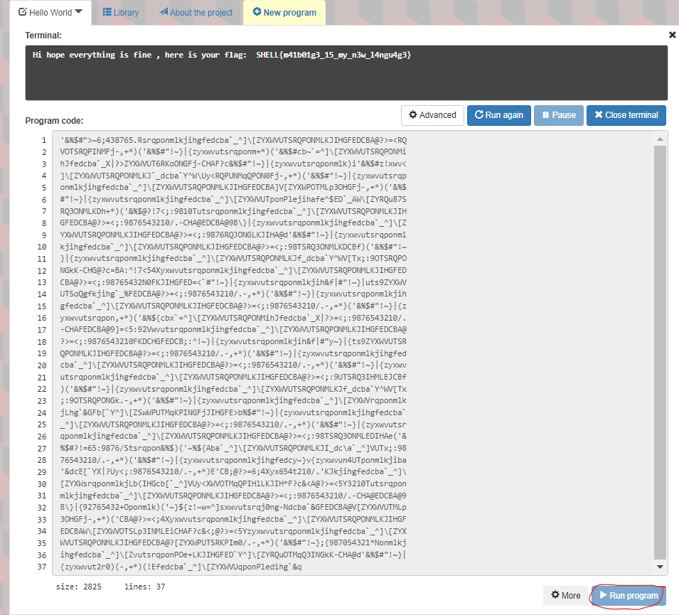
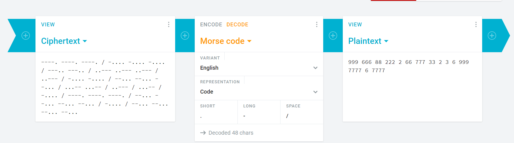
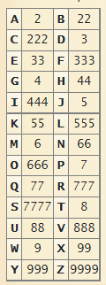

# Cryptographics

- [MALBORNE](#malborne)
- [Tweeeet](#tweeeet)
- [Tring Tring...](#tring-tring)
- [OX9OR2](#ox9or2)
- [Feel me](#feel-me)

# MALBORNE
## Description
``` plaintext
'&%$#">~6;438765.Rsrqponmlkjihgfedcba`_^]\[ZYXWVUTSRQPONMLKJIHGFEDCBA@?>=<RQ
VOTSRQPINMFj-,+*)('&%$#"!~}|{zyxwvutsrqponm+*)('&%$#cb~`=^]\[ZYXWVUTSRQPONMi
hJfedcba`_X|?>ZYXWVUT6RKoONGFj-CHAF?c&%$#"!~}|{zyxwvutsrqponmlk)i'&%$#z!xwv<
]\[ZYXWVUTSRQPONMLKJ`_dcba`Y^W\Uy<RQPUNMqQPON0Fj-,+*)('&%$#"!~}|{zyxwvutsrqp
onmlkjihgfedcba`_^]\[ZYXWVUTSRQPONMLKJIHGFEDCBA]V[ZYXWPOTMLp3OHGFj-,+*)('&%$
#"!~}|{zyxwvutsrqponmlkjihgfedcba`_^]\[ZYXWVUTponPlejihafe^$ED`_AW\[ZYRQu87S
RQ3ONMLKDh+*)('&%$@?!7<;:9810Tutsrqponmlkjihgfedcba`_^]\[ZYXWVUTSRQPONMLKJIH
GFEDCBA@?>=<;:9876543210/.-CHA@EDCBA@98\}|{zyxwvutsrqponmlkjihgfedcba`_^]\[Z
YXWVUTSRQPONMLKJIHGFEDCBA@?>=<;:9876RQJONGLKJIHA@d'&%$#"!~}|{zyxwvutsrqponml
kjihgfedcba`_^]\[ZYXWVUTSRQPONMLKJIHGFEDCBA@?>=<;:98TSRQ3ONMLKDCBf)('&%$#"!~
}|{zyxwvutsrqponmlkjihgfedcba`_^]\[ZYXWVUTSRQPONMLKJf_dcba`Y^WV[Tx;:9OTSRQPO
NGkK-CHG@?c=BA:^!7<54Xyxwvutsrqponmlkjihgfedcba`_^]\[ZYXWVUTSRQPONMLKJIHGFED
CBA@?>=<;:98765432N0FKJIHGFED=<`#"!~}|{zyxwvutsrqponmlkjih&f|#"!~}|uts9ZYXWV
UTSoQgfkjihg`_%FEDCBA@?>=<;:9876543210/.-,+*)('&%$#"!~}|{zyxwvutsrqponmlkjih
gfedcba`_^]\[ZYXWVUTSRQPONMLKJIHGFEDCBA@?>=<;:9876543210/.-,+*)('&%$#"!~}|{z
yxwvutsrqpon,+*)('&%${cbx`=^]\[ZYXWVUTSRQPONMihJfedcba`_X|?>=<;:9876543210/.
-CHAFEDCBA@9]=<5:92Vwvutsrqponmlkjihgfedcba`_^]\[ZYXWVUTSRQPONMLKJIHGFEDCBA@
?>=<;:9876543210FKDCHGFEDCB;:^!~}|{zyxwvutsrqponmlkjih&f|#"y~}|{ts9ZYXWVUTSR
QPONMLKJIHGFEDCBA@?>=<;:9876543210/.-,+*)('&%$#"!~}|{zyxwvutsrqponmlkjihgfed
cba`_^]\[ZYXWVUTSRQPONMLKJIHGFEDCBA@?>=<;:9876543210/.-,+*)('&%$#"!~}|{zyxwv
utsrqponmlkjihgfedcba`_^]\[ZYXWVUTSRQPONMLKJIHGFEDCBA@?>=<;:9UTSRQ3IHMLEJCBf
)('&%$#"!~}|{zyxwvutsrqponmlkjihgfedcba`_^]\[ZYXWVUTSRQPONMLKJf_dcba`Y^WV[Tx
;:9OTSRQPONGk.-,+*)('&%$#"!~}|{zyxwvutsrqponmlkjihgfedcba`_^]\[ZYXWVrqponmlk
jLhg`&GFb[`Y^]\[ZSwWPUTMqKPINGFjJIHGFE>b%$#"!~}|{zyxwvutsrqponmlkjihgfedcba`
_^]\[ZYXWVUTSRQPONMLKJIHGFEDCBA@?>=<;:9876543210/.-,+*)('&%$#"!~}|{zyxwvutsr
qponmlkjihgfedcba`_^]\[ZYXWVUTSRQPONMLKJIHGFEDCBA@?>=<;:98TSRQ3ONMLEDIHAe('&
%$#?!=65:9876/Stsrqpon&%$)('~%${Aba`_^]\[ZYXWVUTSRQPONMLKJI_dc\a`_^]VUTx;:98
76543210/.-,+*)('&%$#"!~}|{zyxwvutsrqponmlkjihgfedcy~}v{zyxwvun4UTponmlkjiba
'&dcE[`YX|?Uy<;:9876543210/.-,+*)E'CB;@?>=6;4Xyx654t210/.'KJkjihgfedcba`_^]\
[ZYXWsrqponmlkjLb(IHGcb[`_^]VUy<XWVOTMqQPIHlLKJIH*F?c&<A@?>=<5Y3210Tutsrqpon
mlkjihgfedcba`_^]\[ZYXWVUTSRQPONMLKJIHGFEDCBA@?>=<;:9876543210/.-CHA@EDCBA@9
8\}|{92765432+Oponmlk)('~}${z!~w=^]sxwvutsrqj0ng-Ndcba`&GFEDCBA@V[ZYXWVUTMLp
3OHGFj-,+*)('CBA@?>=<;4Xyxwvutsrqponmlkjihgfedcba`_^]\[ZYXWVUTSRQPONMLKJIHGF
EDCBAW\[ZYXWVOTSLp3INMLEiCHAF?c&<;@?>=<5Yzyxwvutsrqponmlkjihgfedcba`_^]\[ZYX
WVUTSRQPONMLKJIHGFEDCBA@?[ZYXWPUTSRKPIm0/.-,+*)('&%$#"!~};{987054321*Nonmlkj
ihgfedcba`_^]\[ZvutsrqponPOe+LKJIHGFED`Y^]\[ZYRQuOTMqQ3INGkK-CHA@d'&%$#"!~}|
{zyxwvut2r0)(-,+*)(!Efedcba`_^]\[ZYXWVUqponPledihg`&q

```

## Writeup

Using website: https://malbolge.doleczek.pl/

Malbolge, invented by Ben Olmstead in 1998, is an esoteric programming language
designed to be as difficult to program in as possible.



Flag: **SHELL{m41b01g3_15_my_n3w_l4ngu4g3}**

# Tweeeet
## Description


## Writeup
This is "Birds on a Wire" cipher.

Using website: https://www.dcode.fr/birds-on-a-wire-cipher


Flag: **SHELL{WELOVESINGING}**

# Tring Tring...
## Description

``` plaintext
----. ----. ----. / -.... -.... -.... / ---.. ---.. / ..--- ..--- ..--- / ..--- / -.... -.... / --... --... --... / ...-- ...-- / ..--- / ...-- / -.... / ----. ----. ----. / --... --... --... --... / -.... / --... --... --... --...
```

## Writeup
First time, using [moure decode](https://cryptii.com/pipes/morse-code-translator):


After using [SMS decode](https://www.dcode.fr/multitap-abc-cipher)



Flag: **SHELL{YOUCANREADMYSMS}**

# OX9OR2
## Description

encryption.py
``` python
def xor(msg, key):
    o = ''
    for i in range(len(msg)):
        o += chr(ord(msg[i]) ^ ord(key[i % len(key)]))
    return o
 
with open('message', 'r') as f:
    msg = ''.join(f.readlines()).rstrip('\n')
 
with open('key', 'r') as k:
    key = ''.join(k.readlines()).rstrip('\n')
    
assert key.isalnum() and (len(key) == 9)
assert 'SHELL' in msg
 
with open('encrypted', 'w') as fo:
    fo.write(xor(msg, key))

```

File [encrypted](encrypted).

## Writeup
``` python
import string
from itertools import product
import enchant

d = enchant.Dict("en_US")
f = open("./encrypted", "rb")
ALPHA = string.ascii_uppercase

chall = f.read()

len_flag = len(chall)
len_key = 9
flag = "SHELL{"

def xor(s1, s2):
    key = (s2 * (len(s1) // len(s2) + 1))[0:len(s1)]
    return "".join([chr(c1 ^ c2) for (c1,c2) in zip(s1,key)])

# XORISC
key = xor(chall[0:len(flag)], flag.encode())

for p in product(ALPHA, repeat=3):
    part = "".join(p)
    key_tmp = key + part
    
    f = xor(chall, key_tmp.encode())
    if d.check(key[-1] + part.lower()) and f[6:-1].replace("_","").isalnum():
        print(f, key_tmp)

```

==> Key: XORISCOOL

Flag: **SHELL{X0R_1S_R3VeR51BL3}**

# Feel me
## Description
[Video](video.mp4)

## Writeup
Using: https://www.dcode.fr/braille-alphabet

Flag: **SHELL{YOUCANSEEME}**

