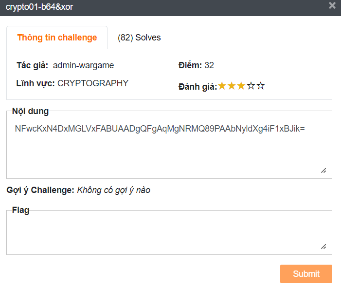
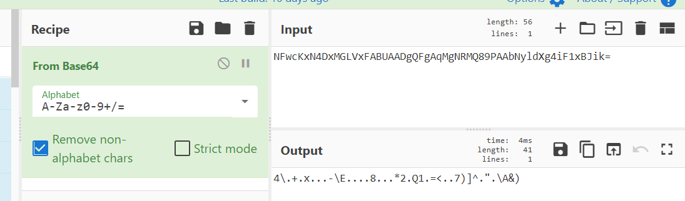
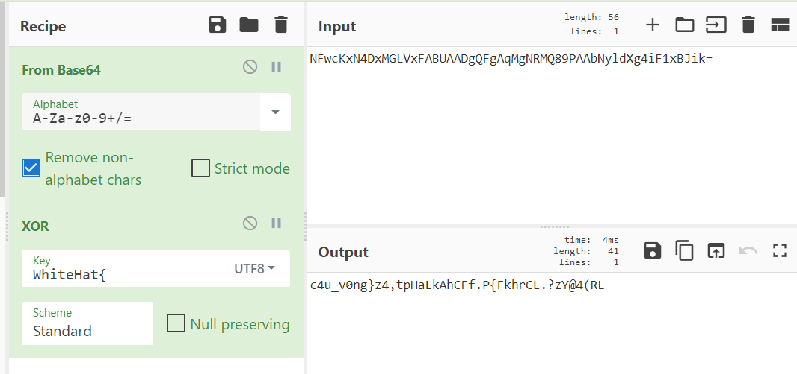

# b64&xor
## Challenge description 

Nội dung:

NFwcKxN4DxMGLVxFABUAADgQFgAqMgNRMQ89PAAbNyldXg4iF1xBJik=

Ở thử thách này cung cập cho chúng ta một cipher (bản mờ) trực tiếp mà không có mô tả hay hint nào.

Có thể thấy hint chính là tên của thử thách.
## Writeup
Từ tên thử thách thử mang đi base64 chuỗi cipher và nhận được kết quả không được tốt. Tool sử dụng trang bài này là [CyberChef](https://gchq.github.io/CyberChef/#recipe=From_Base64('A-Za-z0-9%2B/%3D',true,false)XOR(%7B'option':'UTF8','string':'WhiteHat%7B'%7D,'Standard',false)&input=TkZ3Y0t4TjREeE1HTFZ4RkFCVUFBRGdRRmdBcU1nTlJNUTg5UEFBYk55bGRYZzRpRjF4Qkppaz0):

Tiếp tục mình dự định thực hiện XOR tiếp tục sau đó nhưng nhận ra không có key. Sau đó mình biết được fomat cờ là WhiteHat{…}. Lơi dụng tính chất của XOR là $cipher \wedge key = m ⇒ m \wedge cipher = key$:

Thế là ta có key là c4u_v0ng}. Dùng key đễ XOR thì ra ta lại được môt phần của cờ:

Nhận thấy là thêm key ở sau là ra cờ hoàn chỉnh:

Flag: **WhiteHat{Nh0_c0n_mu4_mua_h@4nh_m0i_th4y_c4u_v0ng}**