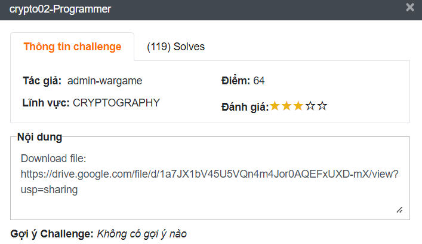
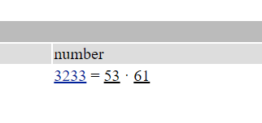

# crypto02-Programmer
## Challenge description 


Nội dung:

Download file: [https://drive.google.com/file/d/1a7JX1bV45U5VQn4m4Jor0AQEFxUXD-mX/view?usp=sharing](https://drive.google.com/file/d/1a7JX1bV45U5VQn4m4Jor0AQEFxUXD-mX/view?usp=sharing)

Đề bài cung cấp cho mình một file python có nội dung như sau:

[crypto02-enc.py](crypto02-enc.py)

```python
from secret import flag

def cal_flag(flag):
	output=[]
	for i in range(len(flag)):
		temp = ord(flag[i])**17%3233
		output.append(temp)
	print(output)

if __name__ == '__main__':
	cal_flag(flag)

#[604, 2170, 3179, 884, 1313, 3000, 1632, 884, 855, 3179, 119, 1632, 2271, 119, 612, 2412, 2185, 2923, 2412, 1632, 2271, 2271, 1313, 2412, 119, 3179, 119, 2170, 1632, 2578, 1313, 119, 2235, 2185, 119, 745, 3179, 1369, 1313, 1516]
```

Thì có thể thấy răng đay là file dùng để mã hoá flag và ở dưới có phần comment là output, bãn mờ của đoạn code ở trên tạo nên sau khi mã hoá flag.
## Writeup
Mấu chốt của bài này là ở đoạn `temp = ord(flag[i])**17%3233` . Đây là vị trí se bi stuck của chúng ta.

Nếu bạn để ý ký thì đó là cách thức mã hoá của hệ mật mã **RSA** có công thức mã hoá là:

- $c = m ^ e\mod n$.

Với  `$n = 3233, e = 17$`  đều là số nguyên tố thì chúng ta khẳng định đậy là giải thuật **RSA.**

Để giải mã ta cần tìm $q$ và $p$ thì truy cập trang web [factordb](http://factordb.com/) và tìm từ $n$ vào:



Từ đây thì quá đơn giản có thực hiện giải mã RSA với công thức giải mã:

- $d  = e ^ -1 \mod φ$
- $φ = (p-1) * (q-1)$
- $m = c ^ d \mod n$

```python
chals = [604, 2170, 3179, 884, 1313, 3000, 1632, 884, 855, 3179, 119, 1632, 2271, 119, 612, 2412, 2185, 2923, 2412, 1632, 2271, 2271, 1313, 2412, 119, 3179, 119, 2170, 1632, 2578, 1313, 119, 2235, 2185, 119, 745, 3179, 1369, 1313, 1516]

p = 53
q = 61
e = 17
φ = (p-1) * (q-1) # phi
d = pow(e, -1, φ) # private key

n = 3233
#encrypt = lambda m: pow(m, e, n)
decrypt = lambda c: pow(c, d, n)

print("[+] Flag: ", end="")
for c in chals:
    print(chr(decrypt(c)), end="")
```

Flag: **WhiteHat{i_am_programmer_i_have_no_life}**
## Reference