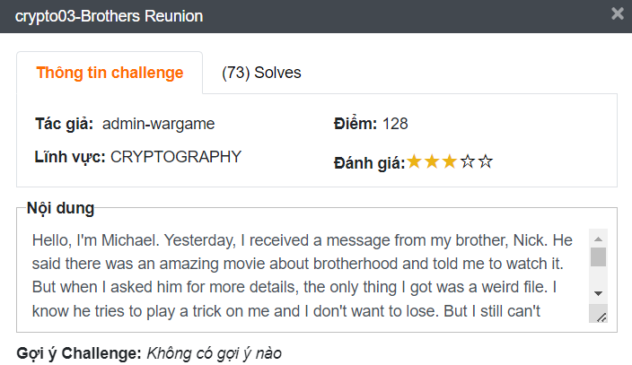

# crypto03-Brothers Reunion
## Challenge description 


**Nội dung:** 

Hello, I'm Michael. Yesterday, I received a message from my brother, Nick. He said there was an amazing movie about brotherhood and told me to watch it. But when I asked him for more details, the only thing I got was a weird file. I know he tries to play a trick on me and I don't want to lose. But I still can't figure out what is the name of the movie. Could you help me out?
Flag format: WhiteHat{flag}
Download file: [https://drive.google.com/file/d/1woc2aKpzLqhiVoBPvMiP2XGDs0kFBt5V/view?usp=sharing](https://drive.google.com/file/d/1woc2aKpzLqhiVoBPvMiP2XGDs0kFBt5V/view?usp=sharing)

Đây là một bài mình hơi stuck một chút khi không đọc kỹ code.

Cơ bản đề cũng cung cấp cho chúng ta một file python có nội dung như sau:

[encode.py](encode.py)

```python
import base64

def hide(flag,secret):
    result = ""
    for i in range(len(flag)):
        char = flag[i]
        if (char.isupper()):
            result += chr((ord(char) + pow(-1,i)*secret - 65) % 26 + 65)
        elif (char.islower()):
            result += chr((ord(char) + pow(-1,i)*secret - 97) % 26 + 97)
        elif (char.isdecimal()):
            result += chr((ord(char) + pow(-1,i)*secret - 48) % 10 + 48)
        else:
            result += char
    return result
def somestuff(message):
    result = ""
    text = message.encode().hex()
    newtext = base64.b64encode(text.encode('ascii')).decode('ascii')
    for i in range(len(newtext) - 1):
        result += str(ord(newtext[i])) + ' '
    result += str(ord(newtext[len(newtext) - 1]))
    data = result.split()
    cmplx = []
    cmplx.append(data[0])
    for i in range(len(data)-1):
        cmplx.append(str(int(data[i+1])%int(data[i])))
        cmplx.append(str(int(data[i+1])//int(data[i])))
    cmplx.append(data[len(data)-1])
    return cmplx
def modify(mylist):
    mystr = ' '.join(mylist)    
    return mystr 
if __name__ == '__main__':
    print(modify(somestuff(hide("K1",5))))

# Number sequence: 
# 78 6 1 65 0 57 1 78 0 28 1 99 0 23 1 78 0 9 1 2 1 33 1 78 0 6 1 81 0 39 1 78 0 9 1 2 1 50 0 40 1 16 1 82 0 25 1 77 0 45 1 103 0 49 0 41 1 16 1 77 0 42 1 78 0 6 1 23 1 15 1 79 0 5 1 77 0 50 0 28 1 28 1 1 1 15 1 79 0 68 0 31 1 53 0 25 1 9 1 2 1 49 0 29 1 44 1 77 0 50 0 27 1 45 1 107 0 50 0 29 1 5 1 77 0 52 0 52
# Secret number:
# 5
```

Ở bài này cung cấp cho mình cả một hàm somestuff có lẽ chúng ta sẽ bị stuck ở đây. Sau khi dùng hàm hide để ẩn flag thì sẽ dùng hàm somestuff để thêm stuff tăng độ khó ⇒ giải mã nhiều lớp.

Cơ bản đề cung cấp cho chúng ta output sau khi mã hoá flag và secret number để chạy hàm hide là 5. Thật chất khi bạn chạy file trên bạn sẽ nhận thấy flag bắt đầu bằng ‘K1’ khi output sẽ bằng một số giá trị ở đầu output khi mã hoá flag.

Hàm modify đơn giản là dùng để trả format lại output. Không gì đáng để quan tâm.

### Phân tích hàm somestuff.

Ở đây mình giả dụ đầu vào của hàm này là ‘P1’ ⇒ somestuff(’P1’). Sẽ trải qua các bước sau:

```python
text = message.encode().hex()
```

- Bước 1: input sẽ được chuyển qua chuỗi hex ứng với giá trị của input.
- Bước 2: Mã Base64 đoạn hex đó và tách từng ký tự ra và cho vào một mảng (đoạn này làm rối mắt người đọc thui chứ có thể  viết dễ hiểu hơn) lưu vào biến *data*.

```python
newtext = base64.b64encode(text.encode('ascii')).decode('ascii')
for i in range(len(newtext) - 1):
	result += str(ord(newtext[i])) + ' '
result += str(ord(newtext[len(newtext) - 1]))
data = result.split()
```

- Bước 3: Tạo ra một mãng rỗng cmplx  - *đây cũng là giá trị trả về cuối cùng*. Thực hiện thêm biến đầu tiên của mãng *data* vào . Tiếp tục lặp liên tục thêm các giá trị vào theo công thức ở dưới, sau đó thêm giá trị cuối của mãng *data* vào.
    - $d_{i+1}\mod d_{i},\space\space d_{i+1}// d_{i},\space\space d_{i+2}\mod d_{i+1},\space\space d_{i+2}// d_{i+1},\dots$

```python
cmplx = []
cmplx.append(data[0])
    
for i in range(len(data)-1):
    cmplx.append(str(int(data[i+1]) % int(data[i])))
    cmplx.append(str(int(data[i+1]) // int(data[i])))
cmplx.append(data[len(data)-1])
return cmplx
```

### Phân tích hàm hide.

Đầu vào là một chuỗi và môt số làm secret number. Tiến hành mã hoá từng kí tự tuỳ thuộc vào là chữ hoa, chữ thường hoặc số mà mỗi ký tự thuộc trường nào. Áp dụng công thức sau:

- $(c + (-1)^i * s - n)\mod l - n$
- Trong đó:
    - c: là ký tự cần mã hoá.
    - i: là vị số thứ tự của ký tự trừ đi 1 (bắt đầu từ 0).
    - s: là secret number.
    - n: nếu là chữ thường là 97 - chữ hoa là 65 - là số là 48. Ở đây 97 theo bảng mã ASCII khi đổi qua dạng ký tự là ‘a’, 65 là ‘A’, 48 là ‘0’.
    - l: l=26 nếu là chữ cái l=10 nếu là số.
## Writeup
1. Thực hiện chuyển các output đề cho thành đầu vào mình mong muốn:

```python
import string
import base64
import binascii

cipher = '78 6 1 65 0 57 1 78 0 28 1 99 0 23 1 78 0 9 1 2 1 33 1 78 0 6 1 81 0 39 1 78 0 9 1 2 1 50 0 40 1 16 1 82 0 25 1 77 0 45 1 103 0 49 0 41 1 16 1 77 0 42 1 78 0 6 1 23 1 15 1 79 0 5 1 77 0 50 0 28 1 28 1 1 1 15 1 79 0 68 0 31 1 53 0 25 1 9 1 2 1 49 0 29 1 44 1 77 0 50 0 27 1 45 1 107 0 50 0 29 1 5 1 77 0 52 0 52'.split()
cipher
```

Output:

```bash
['78', '6', '1', '65', '0', '57', '1', '78', '0', '28', '1', '99', '0', '23', '1', '78', '0', '9', '1', '2', '1', '33', '1', '78', '0', '6', '1', '81', '0', '39', '1', '78', '0', '9', '1', '2', '1', '50', '0', '40', '1', '16', '1', '82', '0', '25', '1', '77', '0', '45', '1', '103', '0', '49', '0', '41', '1', '16', '1', '77', '0', '42', '1', '78', '0', '6', '1', '23', '1', '15', '1', '79', '0', '5', '1', '77', '0', '50', '0', '28', '1', '28', '1', '1', '1', '15', '1', '79', '0', '68', '0', '31', '1', '53', '0', '25', '1', '9', '1', '2', '1', '49', '0', '29', '1', '44', '1', '77', '0', '50', '0', '27', '1', '45', '1', '107', '0', '50', '0', '29', '1', '5', '1', '77', '0', '52', '0', '52']
```

1. Chúng ta sẽ bắt đầu giải quyết vấn đề từ hàm somstuff. 
- Thì với việc mãng đầu vào theo phân tích ở trên ta có thể thấy giá trị đầu tiên của mảng cũng là giá trị đầu tiên của mess (chuỗi chưa qua hàm somestuff) - gọi là a. Lần lượt tiếp theo đó là các giá trị mod và div và chúng ta cũng k cần quan tâm đến giá trị cuối cùng của mảng.
- Ý tưởng là sẽ thực hiện brute force từng ký tự một kiểm tra xem các ký tự đó có theo điều kiện không, gọi b là số cần tìm thì điều kiện là:
    - $b\mod a = mod \space and \space b \div a = div$.
- Tạo ra một bảng chứ cái bao gồm chữ, số và các ký tự đặc biệt chỉ xuất hiện trong base64 encode bởi vì đầu vào đã được base64 gọi là ALPHA thì  $b \in ALPHA$ thử hết tất cả trường hợp nào khớp điều kiện trên là được.
- Sau đó decode base64  ra một chuổi hex lại decode hex là ra lại được mess.
- Ở dưới mình có viết một hàm de_somestuff để giải somstuff:

```python
def de_somestuff(cipher):
    alpha_b64 = [ord(c) for c in (string.ascii_letters + string.digits + "+/=")]

    a = int(cipher[0])
    data = [a]
    # stuff:
    # (b % a), (b // a), (c % b), (c // b), (d % c), (d // c)
    # de_stuff:
    for i in range(1, len(cipher) - 1, 2):
        Mod = int(cipher[i])
        Div = int(cipher[i + 1])

        for b in alpha_b64:
            if b % a == Mod and b // a == Div:
                a = b
                break
        
        data.append(a)

    result = "".join([chr(c) for c in data])
    newtext = base64.b64decode(result).decode('ascii')
    return binascii.unhexlify(newtext).decode('ascii')
```

2. Giải quyết hàm Hide.
- Đơn giản bạn chỉ cần tạo ra một hàm Show để giải ngược lại.
- Ta có công thức đã phân tích ở phần trên chỉ cần tạo ra một công thức giải. Công thức giải như sau:
    - $(c - (-1)^i * s - n)\mod l + n$
    - Trong đó:
        - c: là ký tự cần giải mã.
        - i: là vị số thứ tự của ký tự trừ đi 1 (bắt đầu từ 0).
        - s: là secret number.
        - n: nếu là chữ thường là 97 - chữ hoa là 65 - là số là 48. Ở đây 97 theo bảng mã ASCII khi đổi qua dạng ký tự là ‘a’, 65 là ‘A’, 48 là ‘0’.
        - l: l=26 nếu là chữ cái l=10 nếu là số.
    
- Code tham khảo:

```python
def show(cipher, secret):
    result = ""
    for i in range(len(cipher)):
        char = cipher[i]
        if (char.isupper()):
            result += chr((ord(char) - pow(-1,i) * secret - 65) % 26 + 65)
        elif (char.islower()):
            result += chr((ord(char) - pow(-1,i) * secret - 97) % 26 + 97)
        elif (char.isdecimal()):
            result += chr((ord(char) - pow(-1,i) * secret - 48) % 10 + 48)
        else:
            result += char
    return result
```

3. Kết hợp tất cả các cách giải quyết các hàm lại theo thứ tự  với đề bài đã cho là ra cờ. Toàn bộ code để giải:

```python
#!/usr/bin/python3

import string
import base64
import binascii

cipher = '78 6 1 65 0 57 1 78 0 28 1 99 0 23 1 78 0 9 1 2 1 33 1 78 0 6 1 81 0 39 1 78 0 9 1 2 1 50 0 40 1 16 1 82 0 25 1 77 0 45 1 103 0 49 0 41 1 16 1 77 0 42 1 78 0 6 1 23 1 15 1 79 0 5 1 77 0 50 0 28 1 28 1 1 1 15 1 79 0 68 0 31 1 53 0 25 1 9 1 2 1 49 0 29 1 44 1 77 0 50 0 27 1 45 1 107 0 50 0 29 1 5 1 77 0 52 0 52'

cipher = cipher.split()

def show(cipher, secret):
    result = ""
    for i in range(len(cipher)):
        char = cipher[i]
        if (char.isupper()):
            result += chr((ord(char) - pow(-1,i) * secret - 65) % 26 + 65)
        elif (char.islower()):
            result += chr((ord(char) - pow(-1,i) * secret - 97) % 26 + 97)
        elif (char.isdecimal()):
            result += chr((ord(char) - pow(-1,i) * secret - 48) % 10 + 48)
        else:
            result += char
    return result

def de_somestuff(cipher):
    alpha_b64 = [ord(c) for c in (string.ascii_letters + string.digits + "+/=")]

    a = int(cipher[0])
    data = [a]
    # stuff:
    # (b % a), (b // a), (c % b), (c // b), (d % c), (d // c)
    # de_stuff:
    for i in range(1, len(cipher) - 1, 2):
        Mod = int(cipher[i])
        Div = int(cipher[i + 1])

        for b in alpha_b64:
            if b % a == Mod and b // a == Div:
                a = b
                break
        
        data.append(a)

    result = "".join([chr(c) for c in data])
    newtext = base64.b64decode(result).decode('ascii')
    return binascii.unhexlify(newtext).decode('ascii')

if __name__ == "__main__":
    mess_hide = de_somestuff(cipher)
    print("[+] Flag: WhiteHat{%s}" % show(mess_hide, 5))
```

Flag: **WhiteHat{K1n_0F_tH3_5T41n3d_B14d3}**
## Reference