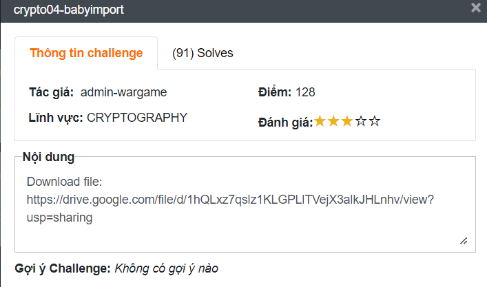

# crypto04-babyimport
## Challenge description 


Nội dung:

Download file: [https://drive.google.com/file/d/1hQLxz7qslz1KLGPLlTVejX3alkJHLnhv/view?usp=sharing](https://drive.google.com/file/d/1hQLxz7qslz1KLGPLlTVejX3alkJHLnhv/view?usp=sharing)

Cung cấp cho chúng ta một file python có nội dung như sau:

[crypto04-babyimport.zip](crypto04-babyimport.zip)

```python
#!/usr/bin/python3
from xiao import flag

def check(flag):
	for i in flag:
		assert len(format(ord(i), 'b')) == 7

def zero_to_one(bin_):
	str_ = ''
	for i in bin_:
		if i == '0': str_ +='1'
		else: str_ += '0'
	else: print('End.')
	return str_

def convert(flag):
	bin_ = ' '.join(format(ord(x), 'b') for x in flag).replace(' ','1')
	print("bin_: ",zero_to_one(bin_))

if __name__ == '__main__':
	check(flag)
	convert(flag)
#bin_:  01010000001011100010110000010110001101000110111000111100000101100000100000101100001001000001111000100000000110100001011001000000010000000011101000010100000101100100000000101100010000000011011000100000001000100001011001000000001110000011110000011010001101000000010
```

Thì như hai bài trước cũng là có đễ má hoá flag và output sau khi mã hoá code là cipher.

Chức năng của các ham bao gồm:

- check: không quan trọng. Kiểm tra flag với độ dài từng kí tự sau khi chuyển qua binary string có bằng 7 không.
- zero_to_one: chuyển các bin 0 thành 1 và ngược lại. Đầu vào là một binary string.
- convert: một hàm thú vị khi tạo thêm các binary để gấy khó trong việc giải mã.
    - Đầu vào là một chuỗi.
    - Lặp các kí tự biến các kí tự thành dạng binary string xong ghép các chuỗi binary này lai với nhau ở giữa các chuỗi này được thêm một binary 1. Ví dụ: 01010101 + 1 + 01010101 ⇒ 01010101101010101
## Writeup
1. Đầu tiên cấu tạo lai output thành input mình mong muốn đễ giải mã. Thực hiện đão binary có thể mượn lại hàm zero_to_one trong đề hoặc như code dưới. Đồng thời tạo một bảng chữ cái phụ vụ sau đó:

```python
import string

ALPHA = "_{}" + string.ascii_lowercase + string.ascii_uppercase

bin =  '01010000001011100010110000010110001101000110111000111100000101100000100000101100001001000001111000100000000110100001011001000000010000000011101000010100000101100100000000101100010000000011011000100000001000100001011001000000001110000011110000011010001101000000010'
bin = "".join(["0" if b == "1" else "1" for b in bin])
```

1. Ở bài này ý tưởng là thực hiện thử hết kết quả. Ta có thể thấy rằng `bin_1 + 1 + bin_2 + 1 + ...` => ta thử tất cả các ký tự (`c`) trong bảng chữ cái xem cái nào thoả mãn điều kiện sau: `to_bin(c) + 1 = bin_n + 1`. Code tham khảo:

```python
import string

ALPHA = "_{}" + string.ascii_lowercase + string.ascii_uppercase

bin =  '01010000001011100010110000010110001101000110111000111100000101100000100000101100001001000001111000100000000110100001011001000000010000000011101000010100000101100100000000101100010000000011011000100000001000100001011001000000001110000011110000011010001101000000010'
bin = "".join(["0" if b == "1" else "1" for b in bin])

flag = ""
while True:
    for c in ALPHA:
       t = format(ord(c), 'b')
       if bin.startswith(t + "1"):
           flag += c
           print(flag)
           bin = bin[len(t) + 1:]
           break
    if len(bin) <= 8:
        flag += chr(int('0b' + bin, 2))
        break
       
print(flag)
```

Flag: **WhiteHat{import__but_i_dont_care}**
## Reference