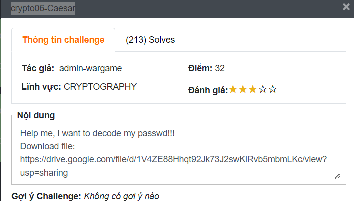
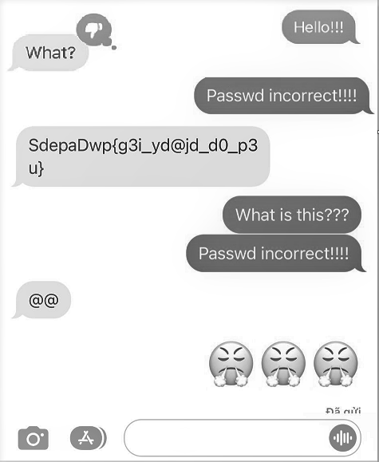
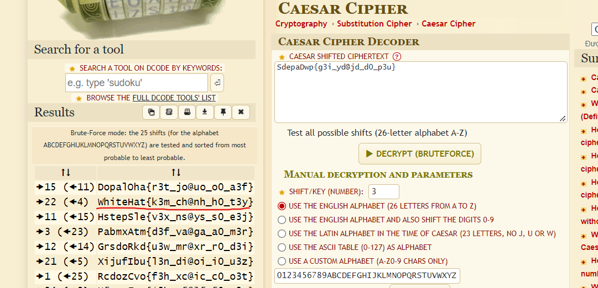

# crypto06-Caesar
## Challenge description


Nội dung:

Help me, i want to decode my passwd!!!
Download file:
[https://drive.google.com/file/d/1V4ZE88Hhqt92Jk73J2swKiRvb5mbmLKc/view?usp=sharing](https://drive.google.com/file/d/1V4ZE88Hhqt92Jk73J2swKiRvb5mbmLKc/view?usp=sharing)

Thử thách cho một file ảnh như này:



Ta có bàn mờ là: `SdepaDwp{g3i_yd@jd_d0_p3u}`

Theo tên thử thách thì đơn giản là dùng hệ mã hoá **Caesar.**
## Writeup
Thật ra chỉ đơn giản là cearsa bạn có thể vào trang [https://www.dcode.fr/caesar-cipher](https://www.dcode.fr/caesar-cipher) để brute force key và giải mã.



Hoặc có thể dùng code ở dưới:

```python
def brute_force_ceasar(cipher, alpha, sig):
    for key in range(1, len(alpha) + 1):
        m = ""
        for c in cipher:
            if c.lower() in alpha:
                index = ((alpha.find(c.lower()) + 1 - key) % len(alpha)) - 1
                m += alpha[index].lower() if c.islower() else alpha[index].upper()
            else:
                m += c
        if sig.upper() in m.upper():
            print("key: {}\nPlain text: {}".format(key, m))
            return
    print("Not found!!!")
    
brute_force_ceasar('SdepaDwp{g3i_yd@jd_d0_p3u}', 'abcdefghijklmnopqrstuvwxyz', 'WhiteHat{')
```

Flag: **WhiteHat{k3m_ch@nh_h0_t3y}**
## Reference