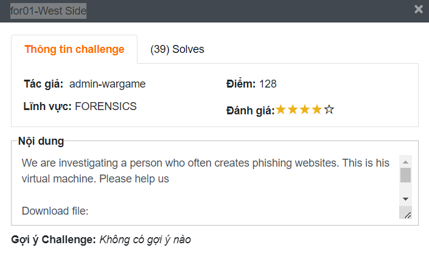
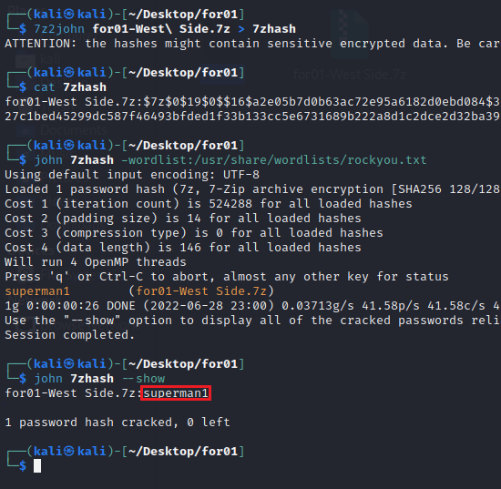
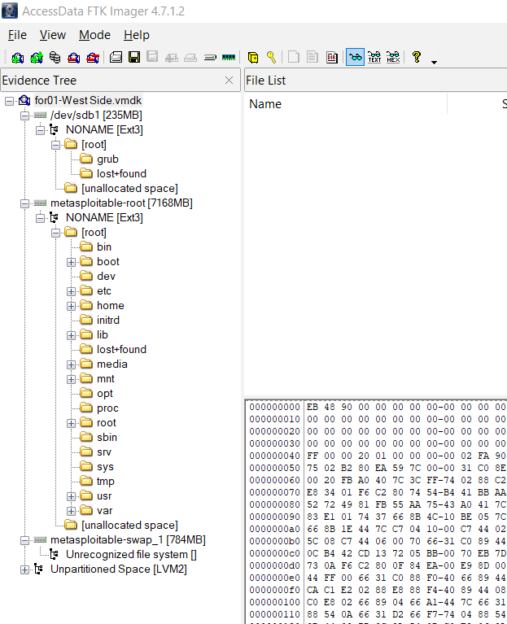
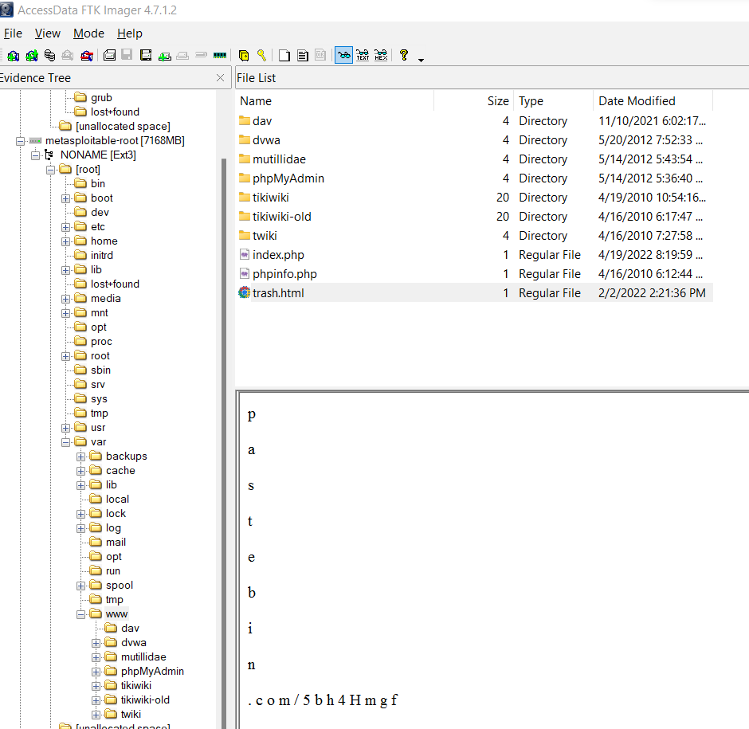
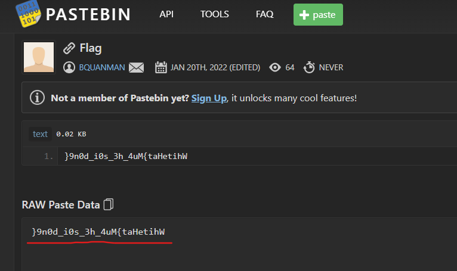

# for01-West Side

## Challenge Analysis

Nội dung: 

We are investigating a person who often creates phishing websites. This is his virtual machine. Please help us

Download file: [https://drive.google.com/file/d/1GV87Cood6h7ne0x_PJ4IjkUchRI35MuG/view?usp=sharing](https://drive.google.com/file/d/1GV87Cood6h7ne0x_PJ4IjkUchRI35MuG/view?usp=sharing)

[for01-West Side.7z](https://drive.google.com/file/d/1RmchOXVCe9VcEYO1dIUjCV2PSssnHoX5/view?usp=sharing)

Cung cấp cho chúng ta một file 7zip và không cung cấp password.

## Writeup

1. Đầu tiên chúng ta sẽ đi crack password cho file 7zip. Mật khẩu cũng không quá khó tìm khi dùng file :

Password: superman1

Sau khi giải nén ta được file for01-West Side.vmdk là một file image của máy ảo đúng với nội dung đề cung cấp.

2. Mở file for01-West Side.vmdk bằng phần mềm FTK Imager. Và xuất hiện rất nhiều file. Có thể thấy chúng ta sẽ tập trung tìm kiếm ở phân vùng metasploitable-root.

3. Sau một thời gian tìm kiếm ở mọi ngóc ngách thì mình mới tịnh tâm đọc nội dung và thấy tên đề là kiểu chơi chữ từ web sit,  mình lập tức bay vào thư mục `/var/www/` để tìm kiếm. Tìm một hồi thì tìm ra một file có nội dung như sau:

Ghép các nội dung lại tạo thành một đường dẫn như sau: [https://pastebin.com/5bh4Hmgf](https://pastebin.com/5bh4Hmgf)

4. Ta đã có flag bị đảo ngược chỉ cần đảo ngược lại là xong:

Flag: **WhiteHat{Mu4_h3_s0i_d0n9}**
## Reference
