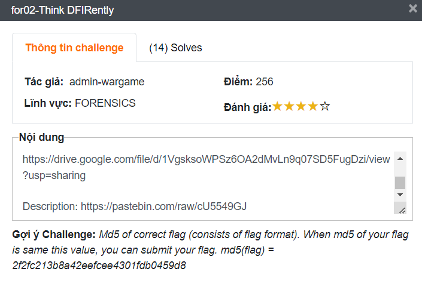
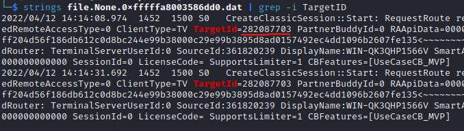
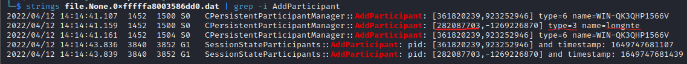

# for02-Think DFIRently



**Nội dung:**

We need your help to investigate a suspected computer, can you answer the following questions?

1. How many times has the user turned on their default browser in total and when was the last time it was launched from the taskbar?
*Format: X_DDMMYYYY-HH:MM:SS (X is an integer, no time conversion needed)
2. What is the ID,hostname connected by remote access tool?
*Format: 111222444_hostname
3. What version does the messaging app use?

Flag Format: WhiteHat{NumberOfTimes_LastTime_ID_Hostname_Version}

Example:

- NumberOfTimes: 20
- LastTimeLaunched: 2022-04-30 06:09:59
- ID: 821029924
- Hostname: WIN-QK3QHP1567V
- Version: 20.22.0

Submit flag as: WhiteHat{20_30042022-06:09:59_821029924_WIN-QK3QHP1567V_20.22.0}

Download file: [https://drive.google.com/file/d/1VgsksoWPSz6OA2dMvLn9q07SD5FugDzi/view?usp=sharing](https://drive.google.com/file/d/1VgsksoWPSz6OA2dMvLn9q07SD5FugDzi/view?usp=sharing)

Description: [https://pastebin.com/raw/cU5549GJ](https://pastebin.com/raw/cU5549GJ)

**Gợi ý Challenge:** *Md5 of correct flag (consists of flag format). When md5 of your flag is same this value, you can submit your flag. md5(flag) = 2f2fc213b8a42eefcee4301fdb0459d8*

## Challenge Analysis

Tải file về ta thấy một file raw và kiểm tra là một file memory dump ra. Có thể thấy là chúng ta sẽ get các thông tin truy cập trình duyệt web và ghép chúng lại thành cờ theo format cho sẵn. Các thông tin cần tìm kiếm đã được liệt kê trong nội dung.

## Writeup

1. Ở đây mình dùng phần mềm https://github.com/volatilityfoundation/volatility để phân tích memory.  Tìm thông tin của hệ thống như sau:
    
```bash
┌──(kali㉿kali)-[~/Desktop]
└─$ vol.py -f for02-Think\ DFIRently.raw imageinfo             
Volatility Foundation Volatility Framework 2.6.1
INFO    : volatility.debug    : Determining profile based on KDBG search...
          Suggested Profile(s) : Win7SP1x64, Win7SP0x64, Win2008R2SP0x64, Win2008R2SP1x64_24000, Win2008R2SP1x64_23418, Win2008R2SP1x64, Win7SP1x64_24000, Win7SP1x64_23418
...
```

Ở đây mình chon profile là: `Win7SP1x64_23418` cho các phần phía dưới
    
2. Đầu tiên mình sẽ tìm thông tin sử dụng default browser.

Tìm kiếm default browser hiện tại là gì. Và cũng khá đơn gian khi chuyện này chúng ta có thể biết được nhờ việc xem Registry. Với đường dẫn: `HKEY_CURRENT_USER\SOFTWARE\Microsoft\Windows\Shell\Associations\URLAssociations\(http|https)\UserChoice`  trong đó http hay https chỉ chọn 1:
    
```bash
┌──(kali㉿kali)-[~/Desktop]
└─$ vol.py --profile=Win7SP1x64_23418 -f for02-Think\ DFIRently.raw  printkey -K "Software\Microsoft\Windows\Shell\Associations\UrlAssociations\http\UserChoice"
Volatility Foundation Volatility Framework 2.6.1
Legend: (S) = Stable   (V) = Volatile

----------------------------
Registry: \??\C:\Users\cuonghk\ntuser.dat
Key name: UserChoice (S)
Last updated: 2022-04-12 07:16:14 UTC+0000

Subkeys:

Values:
REG_SZ        Progid          : (S) FirefoxURL
```

Và ở đây chúng ta có thể thấy `Firefox` là default browser:
    
Ban  đầu mình nghỉ lấy các thông tin số lần mở browser và lần mở cuối trên thanh taskbar ở trong các file **pf** trong thư mục **Prefetch nhưng mình thấy các thông tin đó** nó khá chung chung và không đưa ra được đúng thứ mình mong muốn. Thế là mình tham khảo tư nhiều nguồn thì có thể sử dụng plugin userassist để giải quyết vấn đề này:
        
```bash
┌──(kali㉿kali)-[~/Desktop]
└─$ vol.py --profile=Win7SP1x64_23418 -f for02-Think\ DFIRently.raw  userassist
...
```

- Thông tin mở browser trên taskbar (count) và lần truy cập cuối (Last updated):

```bash
...
REG_BINARY    %APPDATA%\Microsoft\Internet Explorer\Quick Launch\User Pinned\TaskBar\Mozilla Firefox.lnk : 
Count:          3
Focus Count:    0
Time Focused:   0:00:00.503000
Last updated:   2022-04-12 07:14:55 UTC+0000
Raw Data:
0x00000000  00 00 00 00 03 00 00 00 00 00 00 00 03 00 00 00   ................
0x00000010  00 00 80 bf 00 00 80 bf 00 00 80 bf 00 00 80 bf   ................
0x00000020  00 00 80 bf 00 00 80 bf 00 00 80 bf 00 00 80 bf   ................
0x00000030  00 00 80 bf 00 00 80 bf ff ff ff ff a0 0c aa 02   ................
0x00000040  3d 4e d8 01 00 00 00 00
...
```

- Thông tin mở browser từ nguồn khác (count):

```bash
...
REG_BINARY    C:\Users\Public\Desktop\Mozilla Firefox.lnk : 
Count:          4
Focus Count:    0
Time Focused:   0:00:00.504000
Last updated:   2022-04-12 07:16:12 UTC+0000
Raw Data:
0x00000000  00 00 00 00 04 00 00 00 00 00 00 00 04 00 00 00   ................
0x00000010  00 00 80 bf 00 00 80 bf 00 00 80 bf 00 00 80 bf   ................
...
```

Vây là các thông tin thu tập được ở phần này bao gồm:

- NumberOfTimes: `7`
- LastTimeLaunched: `2022-04-12 07:14:55`
3. Bây giờ chúng ta sẽ tìm thông tin về phần mềm remote đến. Thật sự mình cũng không nghỉ ra cách nào hay và chỉ thử kiếm các phần mềm nổi tiếng trước xem nó có process tree không thì không ngờ ăn lun và nó chính là phần mềm Teamviewer:
    
```bash
┌──(kali㉿kali)-[~/Desktop]
└─$ vol.py --profile=Win7SP1x64_23418 -f for02-Think\ DFIRently.raw  pstree | grep -i teamviewer
Volatility Foundation Volatility Framework 2.6.1
.. 0xfffffa8003527990:TeamViewer_Ser                 1452    500     23    390 2022-04-12 07:12:59 UTC+0000
WARNING : volatility.debug    : PID 888 PPID 3068 has already been seen
WARNING : volatility.debug    : PID 2708 PPID 3068 has already been seen
. 0xfffffa8001f75760:TeamViewer.exe                  3840   2864      0 ------ 2022-04-12 07:13:46 UTC+0000
```

Bây giờ mình sẽ tìm thông tin ID và hostname remote bằng cách xem dump log của Teamviewer ra xem:

- Tìm file log của Teamviewer:

```bash
┌──(kali㉿kali)-[~/Desktop]
└─$vol.py --profile=Win7SP1x64_23418 -f for02-Think\ DFIRently.raw  filescan  | grep  -i "TeamViewer.*log"
Volatility Foundation Volatility Framework 2.6.1
0x000000003d797950     32      0 -W-rw- \Device\HarddiskVolume1\Program Files\TeamViewer\TeamViewer15_Logfile.log
0x000000003d7ebc90     33      1 -W-rw- \Device\HarddiskVolume1\Program Files\TeamViewer\TVNetwork.log
0x000000003dfbf9e0      1      1 -W-rw- \Device\HarddiskVolume1\Program Files\TeamViewer\TeamViewer15_Logfile.log
```

- Dump file log đó ra:

```bash
┌──(kali㉿kali)-[~/Desktop]
└─$ vol.py --profile=Win7SP1x64_23418 -f for02-Think\ DFIRently.raw dumpfiles  -Q 0x000000003d797950 -D "."
Volatility Foundation Volatility Framework 2.6.1
DataSectionObject 0x3d797950   None   \Device\HarddiskVolume1\Program Files\TeamViewer\TeamViewer15_Logfile.log
SharedCacheMap 0x3d797950   None   \Device\HarddiskVolume1\Program Files\TeamViewer\TeamViewer15_Logfile.log
```

- Tìm kiếm thông tin từ file log, bây giờ thì là như đi phân tích log thui. Truy cập trang web [document của Teamviewer](https://community.teamviewer.com/English/kb/articles/109125-teamviewer-documentation-start-here) để biết nhiều hơn về log của phần mềm này:





Các thông tin thu thập được trong phần này là: 

- ID: `282087703`
- Hostname: `longnte`

4. Cuối cùng là tìm kiếm app chat mà mục tiêu đang sự dụng. Thì cũng như trên mình dự tính tìm trong process tree các phần mềm nổi tiếng hiên nay tại Việt Nam. Nhưng nếu đây là kiếm version thì thui mình kiếm tên file lun cho lẹ. Sau một hồi thì mình kiếm được phần mềm Zalo (version mới nhất hiện tại là 22.6.1):
    
```bash
┌──(kali㉿kali)-[~/Desktop]
└─$ vol.py --profile=Win7SP1x64_23418 -f for02-Think\ DFIRently.raw  filescan  | grep -i "Zalo.[0-2]"
Volatility Foundation Volatility Framework 2.6.1
0x0000000024e50330      4      0 R--rwd \Device\HarddiskVolume1\Users\cuonghk\AppData\Local\Programs\Zalo\Zalo-21.2.1\Zalo.exe
0x000000003d63c110      1      1 R--rw- \Device\HarddiskVolume1\Users\cuonghk\AppData\Local\Programs\Zalo\Zalo-21.2.1\locales\en-US.pak
0x000000003d64fcd0      1      1 R--rw- \Device\HarddiskVolume1\Users\cuonghk\AppData\Local\Programs\Zalo\Zalo-21.2.1\resources\app.asar
0x000000003d6acaf0      1      1 R--rw- \Device\HarddiskVolume1\Users\cuonghk\AppData\Local\Programs\Zalo\Zalo-21.2.1\resources\app.asar
```

Và ở phần này mình tìm được thông tin cuối cùng là version: `21.2.1`

Kết hợp tất cả thông tin lại theo format đã cho và ta có flag:  

**WhiteHat{7_12042022-07:14:55_282087703_longnte_21.2.1}**
## Reference
- [https://book.hacktricks.xyz/forensics/basic-forensic-methodology/memory-dump-analysis/volatility-examples#get-a-value](https://book.hacktricks.xyz/forensics/basic-forensic-methodology/memory-dump-analysis/volatility-examples#get-a-value)
- [https://seanthegeek.net/1172/how-to-install-volatility-2-and-volatility-3-on-debian-ubuntu-or-kali-linux/](https://seanthegeek.net/1172/how-to-install-volatility-2-and-volatility-3-on-debian-ubuntu-or-kali-linux/)
- [https://andreafortuna.org/](https://andreafortuna.org/)
    - [Image Identification](https://andreafortuna.org/2017/06/25/volatility-my-own-cheatsheet-part-1-image-identification/)
    - [Processes and DLLS](https://andreafortuna.org/2017/07/03/volatility-my-own-cheatsheet-part-2-processes-and-dlls/)
    - [Process Memory](https://andreafortuna.org/2017/07/10/volatility-my-own-cheatsheet-part-3-process-memory/)
    - [Kernel memory and objects](https://andreafortuna.org/2017/07/17/volatility-my-own-cheatsheet-part-4-kernel-memory-and-objects/)
    - [Networking](https://andreafortuna.org/2017/07/24/volatility-my-own-cheatsheet-part-5-networking/)
    - [Windows Registry](https://andreafortuna.org/2017/07/31/volatility-my-own-cheatsheet-part-6-windows-registry/)
    - [Analyze and convert crash dumps and hibernation files](https://andreafortuna.org/2017/08/07/volatility-my-own-cheatsheet-part-7-analyze-and-convert-crash-dumps-and-hibernation-files/)
    - [Filesystem](https://andreafortuna.org/2017/08/21/volatility-my-own-cheatsheet-part-8-filesystem/)