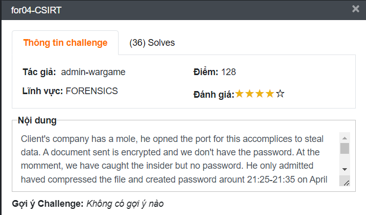
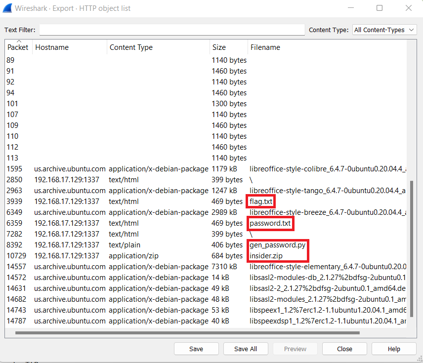
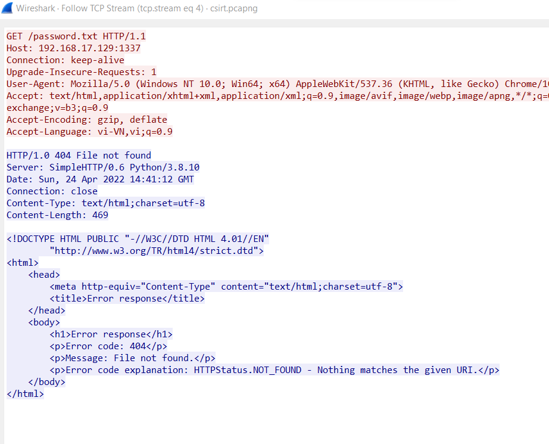

# for04-CSIRT


Nội dung:

Client's company has a mole, he opned the port for this accomplices to steal data. A document sent is encrypted and we don't have the password. At the momment, we have caught the insider but no password. He only admitted haved compressed the file and created password arount **21:25-21:35 on April 24th, 2022 ICT Time**. Can you help me? We have iocs.

Download file: [https://drive.google.com/file/d/1FDN8sGy-2nGAe8CF2YYB77idCPA5W4OG/view?usp=sharing](https://drive.google.com/file/d/1FDN8sGy-2nGAe8CF2YYB77idCPA5W4OG/view?usp=sharing)

## Challenge Analysis

Ở bài này chung ta được cung cấp một  là một file pcap. Và nó được mô tả là IoCs vậy là bên trong file pcap đó sẽ có nhiều IoC hơn nữa. Chúng ta tiến hành tìm kiếm flag trong file pcap này bằng công cụ [Wireshark](https://www.wireshark.org/).

Các thông tin thêm như thời gian tạo ra mật khẩu. Thật đáng ngờ. Chúng ta phải chú ý đến thông tin thêm đó.

## Writeup

1. Đầu tiên mở file pcap bằng [Wireshark](https://www.wireshark.org/). Thì theo kinh nghiệm của mình thì mình sẽ bắt đầu ngay với việc kiểm tra các gói HTTP và ai ngờ có ngay các IoC cần thiết rùi.
    
    
    
    2 file flag.txt và password.txt không hề tồn tại:
    
    
    
    
    
    Còn lại 2 file gen_password.py và một file zip inside.zip. Có thể thấy file gen_password.py dùng để tạo ra mật khẩu ngẫu nhiên. Nội dung file gen_password.py
    
    ```python
    import random
    import hashlib
    import datetime
    
    def gen_Pass(key):
    	password = ''
    	password = hashlib.md5(str(key).encode())
    	password = password.hexdigest()
    	password += '-'
    	password += 'bjAwYg=='
    	return password
    
    if __name__ == '__main__':
    	sed_ = int(datetime.datetime.utcnow().timestamp())
    	random.seed(sed_)
    	key = random.randint(1,1000000000)
    	password = gen_Pass(key)
    	print('Password:', password)
    ```
    
2. Phân tích file gen_password.py.
    
    Nếu xem sơ qua có thể nghỉ rằng đây là một dạnh random password mà chúng ta phải brute force 1 tỷ giá trị mới giải được. Nhưng không mấu chốt nằm ở đoạn:
    
    ```python
    	sed_ = int(datetime.datetime.utcnow().timestamp())
    	random.seed(sed_)
    ```
    
    Vói `random.seed` mặc định python sẽ tạo mặc định để và thay đổi liên tục để đảm bảo tính ngẩu nhiên. Nếu thuộc tính này được set cứng thì giá trị ngẩu nhiên có thể đoán được. Ví dụ:
    
    ```python
    >>> import random
    >>> random.seed(10)
    >>> random.randint(1,1000000000)
    613538869
    ```
    
    Khi bạn chạy đoạn code trên 10 lần thì giá trí của nó vẩn là **613538869.**
    
3. Viết code tạo wordlist password.
    
    Ở đây theo nội dung đề có cung cấp cho chúng ta một khung  thời gian mà tên hacker đã tạo mã. Và trong gen_password.py hacker đã set seed bằng với thời gian hắn chạy trình tạo mã.
    
    Chúng ta thực hiện tao wordlist theo code ở dưới:
    
    ```python
    import random
    import hashlib
    import datetime
    import dateutil.tz
    
    def gen_Pass(key):
        password = ''
        password = hashlib.md5(str(key).encode())
        password = password.hexdigest()
        password += '-'
        password += 'bjAwYg=='
        return password
    
    def solve():
        start_time  = int(datetime.datetime(2022, 4, 24, 14, 25, 0, 0, tzinfo=dateutil.tz.tzoffset('ICT', 7 * 3600)).timestamp())
        end_time = int(datetime.datetime(2022, 4, 24, 14, 36, 0, 0, tzinfo=dateutil.tz.tzoffset('ICT', 7 * 3600)).timestamp())
        
        f = open("./passwd.txt", "a")
        for sed in range(start_time, end_time):
            random.seed(sed)   
            key = random.randint(1, 1000000000)
            passwd = gen_Pass(key)
            f.write(passwd + "\n")
                
        f.close()
    
    solve()
    ```
    
    Ở đây với chỉ cung cấp time ICT và code gen_password.py là dùng UTC để tạo. Offset ICT là UTC +0700  nên ta sẽ giảm 7 tiếng ⇒ house = 14.
    
4. Sau khi tạo thành công wordlist điều còn lại dùng tool [John](https://www.kali.org/tools/john/) để crack password.
    
    ```python
    ┌──(kali㉿kali)-[~/Desktop/for04]
    └─$ zip2john insider.zip >> ziphash
    ...
    ┌──(kali㉿kali)-[~/Desktop/for04]
    └─$ john ziphash --wordlist:passwd.txt
    Using default input encoding: UTF-8
    Loaded 2 password hashes with 2 different salts (ZIP, WinZip [PBKDF2-SHA1 128/128 AVX 4x])
    Loaded hashes with cost 1 (HMAC size) varying from 32 to 74
    Will run 4 OpenMP threads
    Press 'q' or Ctrl-C to abort, almost any other key for status
    b8126bb646aa957307685a4216a46b23-bjAwYg== (insider.zip/insider/flag.txt)     
    b8126bb646aa957307685a4216a46b23-bjAwYg== (insider.zip/insider/database.txt)     
    2g 0:00:00:00 DONE (2022-07-04 04:07) 33.33g/s 11016p/s 22033c/s 22033C/s 4d4eb40b80a0afb8e94e9fbe7f73c9f2-bjAwYg==..b8126bb646aa957307685a4216a46b23-bjAwYg==
    Use the "--show" option to display all of the cracked passwords reliably
    Session completed.
    ```
    
    Password: b8126bb646aa957307685a4216a46b23-bjAwYg==
    

Flag: **WhiteHat{start_again_https://www.youtube.com/watch?v=O0StKlRHVeE}**
## Reference